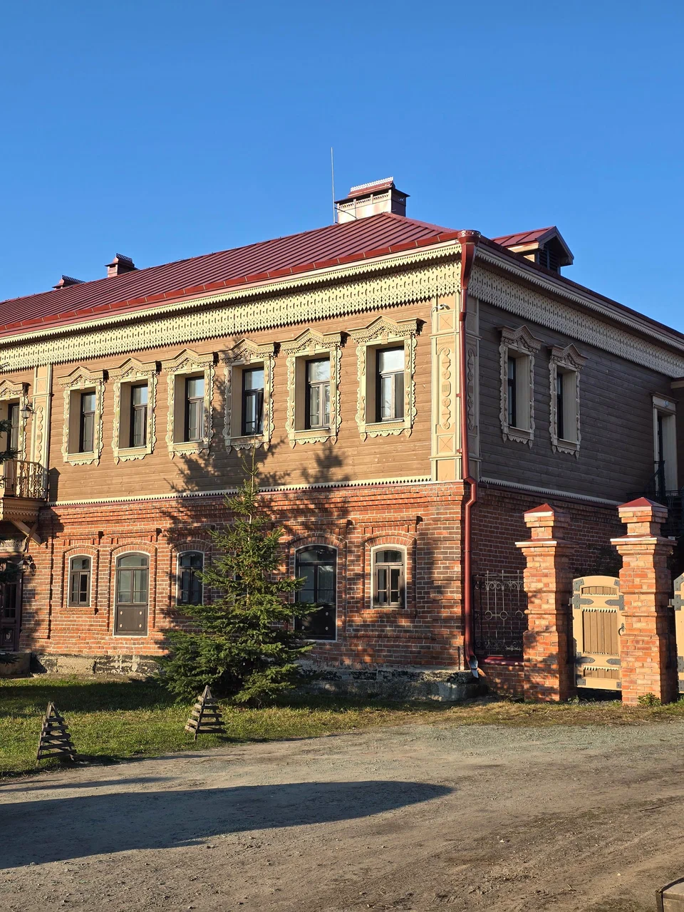
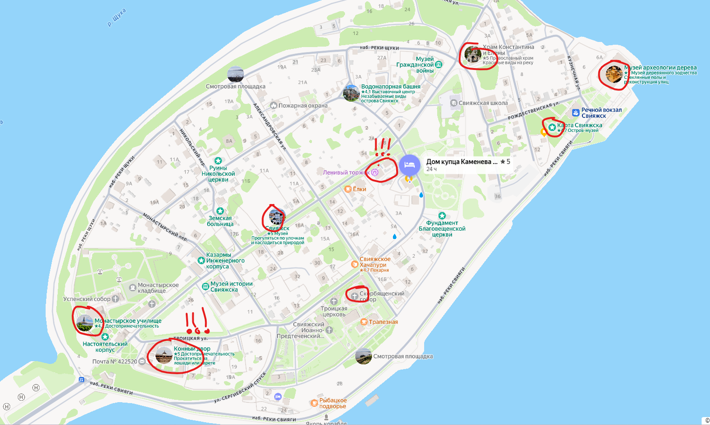

<!--
{
  "draft": false,
  "tags": ["Путешествие"]
}
-->

# Свияжск и Иннополис

```blogEnginePageDate
28 июля 2026
```

Небольшое путешествие выходного дня в Свияжск и Иннополис

## Свияжск

Обязательно заказываем гостиницу https://domkameneva.ru в Свияжске чтобы можно было туда заехать иначе не пустят.



Заезжаем и гуляем везде, особенно загляните на **Конный дворик** и **Ленивый торжок**, там всякие вкусности. В основном
там много музеев. Кафе закрываются рано.



## Иннополис


Покупаем гид тур по иннопослиу, и часик ходим по универу и близлежащему городу. В целом прикольно без гида пришлосьбы
заранее искать места, а так основные она показала. Больших ожиданий не ставьте. И обязательно закажите бесплатное
роботакси.