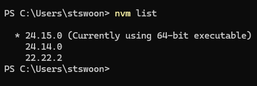

<!--
{
  "draft": false,
  "tags": ["Программирование"]
}
-->

# Средство для смены версий node.js - NVM

```blogEnginePageDate
27 июня 2026
```

Когда собираем java проекты можно легко поменять версию сборщика, для этого досточно установить несколько версий java.
Однако для node.js это не возможно - при установке новой версии стирается старая. Или все же возмонжо? Ответ NVM.

Идем на сайт https://www.nvmnode.com/ и скачивает инструмент, устанавливаем его. Тепер если набрать `nvm list`, то
увидим установленные версии node.js



* Команда `nvm install <version>` (например `nvm install 24.15.0`) позволяет легко установить новую версию.
* Команда `nvm use <version>` позволяет переключаться между версиями.
