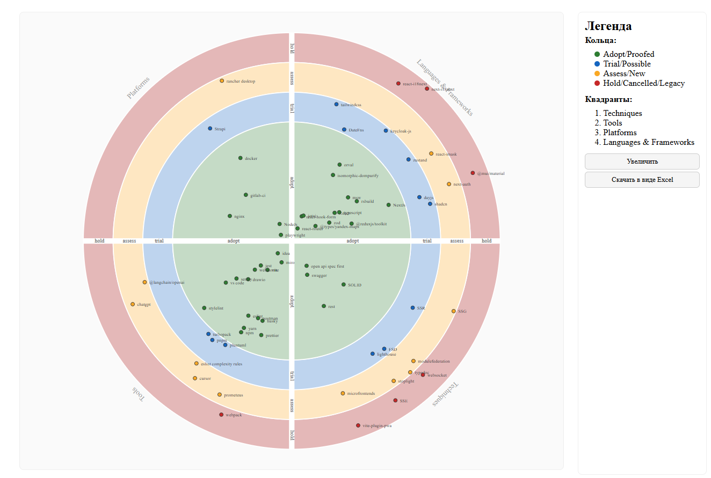
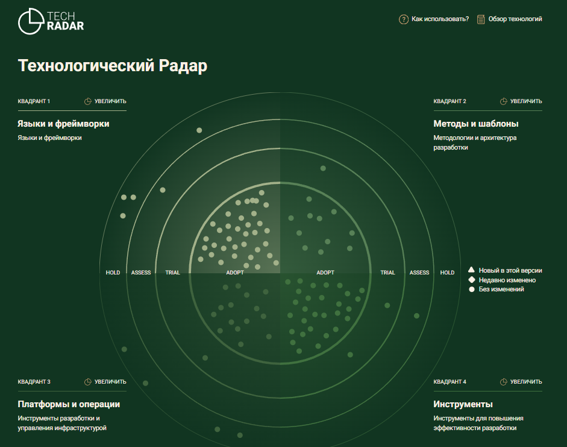
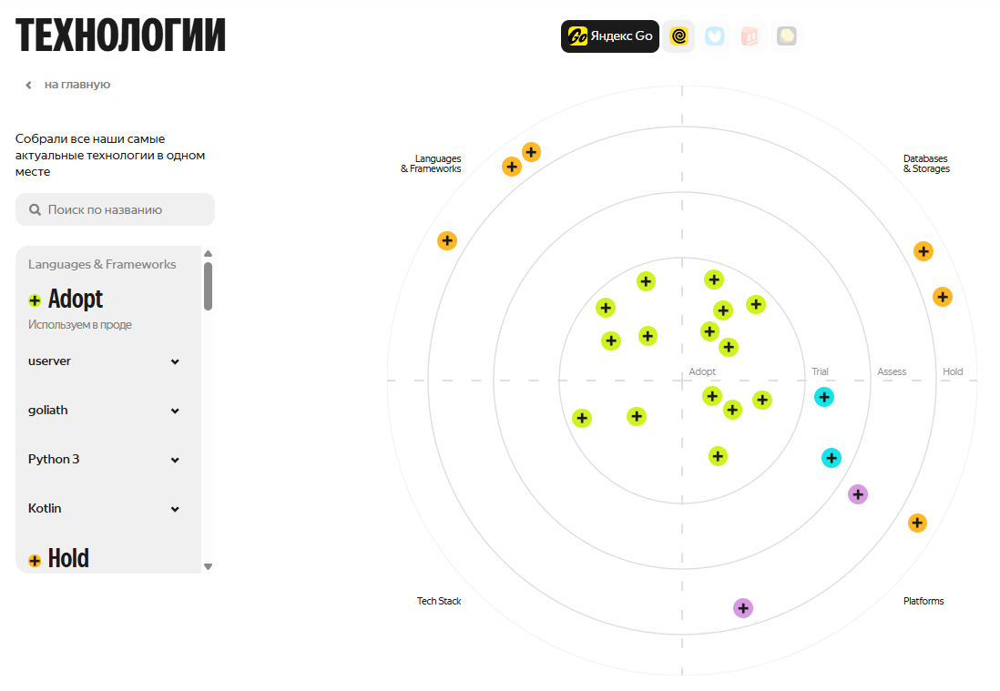
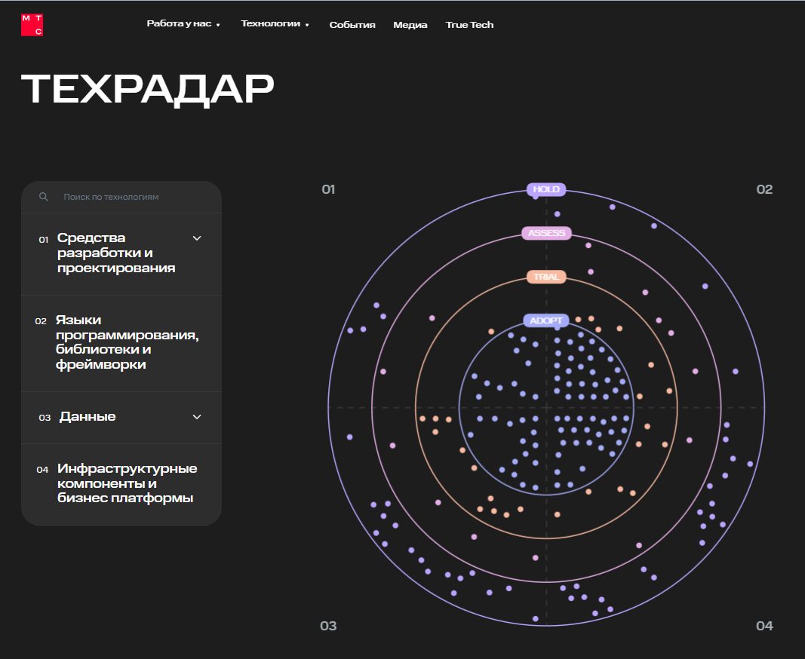
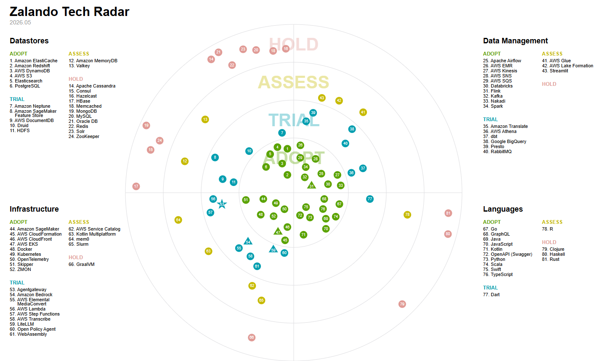
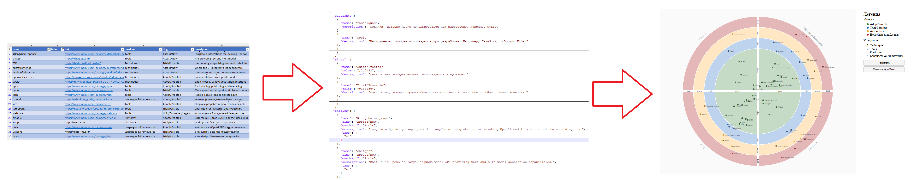

<!--
{
  "draft": false,
  "tags": ["Программирование"]
}
-->

# Тех.Радар

```blogEnginePageDate
30 июня 2026
```

Когда я начал собирать техрадар, казалось, что задача должна решаться просто: подобных схем в интернете много, а сам
формат существует уже давно. На практике оказалось, что готового базового решения, которое можно без существенной
доработки взять за основу - найти непросто.



## Что такое тех.радар

**Техрадар** — это карта технологических решений компании. Он помогает ответить на несколько практических вопросов:

* какие технологии уже считаются стандартом;
* что можно использовать в новых проектах;
* что стоит попробовать в ограниченном пилоте;
* какие решения нужно изучить, но пока не применять в production;
* от каких технологий лучше постепенно уходить.

Обычно техрадар изображают в виде круга, разделённого на сектора и кольца.

Сектора группируют технологии по смыслу. Например:

* языки и фреймворки;
* инструменты разработки;
* платформы и инфраструктура;
* инженерные практики и процессы.

Кольца показывают уровень зрелости технологии для конкретной компании:

* **Adopt** — рекомендуемое решение. Его можно использовать по умолчанию в подходящих новых задачах.
* **Trial** — технология уже показала ценность, но её применение пока стоит ограничивать пилотами или отдельными
  сценариями.
* **Assess** — решение интересно для исследования. Его стоит изучить, проверить на небольшом прототипе, но не выбирать
  как
  основу нового production-проекта.
* **Hold** — технологию не стоит выбирать для новых решений. Для существующих систем может потребоваться план
  постепенной
  замены или ограничение дальнейшего развития.

Ссылки:

* https://habr.com/ru/companies/kuper/articles/645661/
* https://www.thoughtworks.com/radar

## Примеры компаний с тех.радарами

Золотое яблоко - https://techradar.goldapple.ru/



Яндекс - https://dev.go.yandex/tech



МТС - https://mts-digital.ru/technology/techradar/



## Решения в opensource

* thoughtworks/build-your-own-radar
* zalando/tech-radar
* qiwi/tech-radar

Наиболее понятным решением считаю от Zolando - https://github.com/zalando/tech-radar но мне он показался слишком
"плоским", пример https://opensource.zalando.com/tech-radar/:



## Исходный код

Оновная фича моего техрадара - https://github.com/stswoon/tech-radar - это конвертация Excel навыков в Json, а уже
затем отображение в UI. Таким образом можно легко помять навык даже без знания программирования. Также радар
поддерживает разное количество квадрантов и кругов, например 3 или 5, на ваше усмострение.



### 🛠 Технологический стек

- Frontend: React (v19), TypeScript, Vite.
- Обработка данных: Node.js (скрипты для конвертации данных), библиотека exceljs.

### 🔄 Поток данных (Data Flow)

Особенность проекта в том, что источником данных служит Excel-файл, что удобно для редактирования нетехническими
специалистами.

- Источник: Данные хранятся в файле **public/techRadarSource.xlsx**.
- Конвертация: Скрипт xlsx-to-json.js читает Excel-файл и преобразует его в JSON ( src/tech-radar-entries.json ). Этот
  скрипт запускается автоматически перед стартом приложения ( npm run dev ) или сборкой ( npm run build ).
- Отображение: React-компоненты ( src/components/TechRadar.tsx и др.) берут данные из JSON и отрисовывают интерактивный
  радар.

### 📂 Основная структура

- src/App.tsx: Главный компонент, который собирает конфигурацию радара (кольца, квадранты, записи) и передает их в
  компонент визуализации.
- src/tech-radar-structure.json : Конфигурация структуры радара (определение колец и квадрантов).
- xlsx-to-json.js: Скрипт-утилита для обновления данных из Excel.
  По сути, это инструмент для генерации интерактивной карты технологий на основе простой Excel-таблицы.
